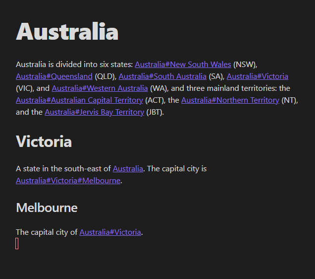

# Truncate Internal Links to Headings

An [Obsidian plugin](https://obsidian.md/) to display [internal links to headings](https://help.obsidian.md/How+to/Internal+link) with only the heading name instead of the the note name, followed by the the parent heading names, and then the heading name. This plugin updates the behaviour in both the editing and reading view. You may see a concrete example of this behaviour in the screenshots below. This a temporary plugin, that will not be needed if the [feature request](https://forum.obsidian.md/t/option-to-display-heading-without-note-title-in-internal-links/22253) is implemented. Please create an issue on [GitHub](https://github.com/scottwillmoore/obsidian-truncate-internal-links-to-headings) if you find any problems with the plugin, or have any suggestions or questions.

| Without plugin                                | With Plugin                             |
| --------------------------------------------- | --------------------------------------- |
|  |  |

